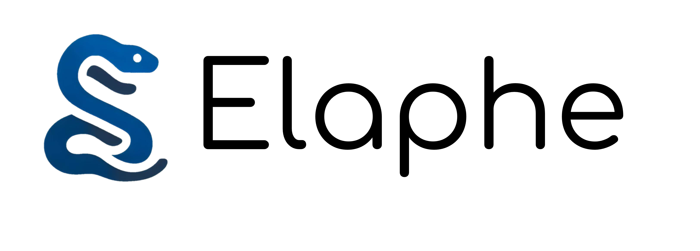
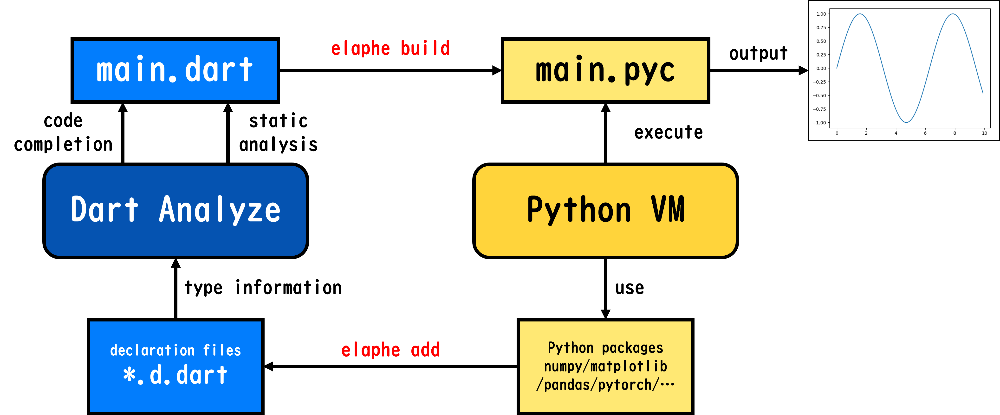
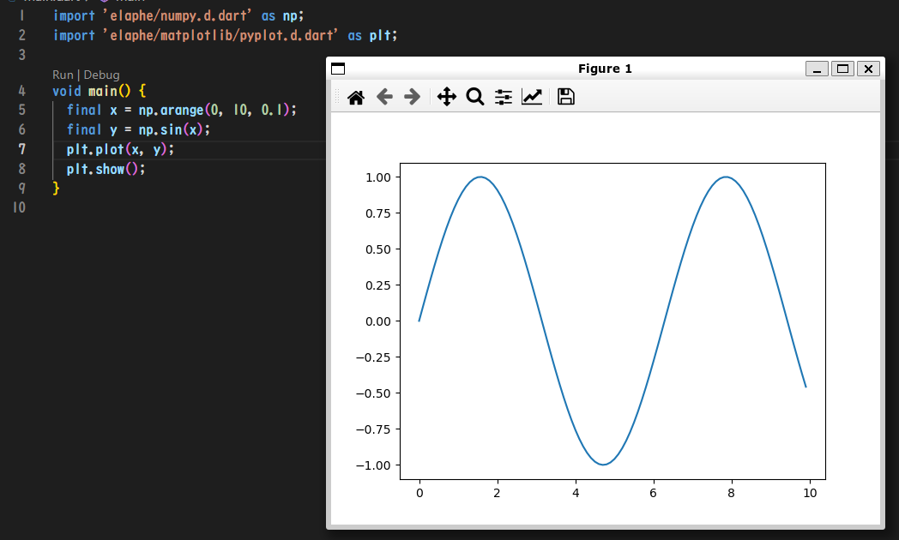

# Elaphe 



Elaphe is a compiler that translates Dart programs into bytecode that runs on the Python virtual machine. With Elaphe, you can utilize the rich libraries of Python while using the syntax and static type checking of Dart.

ElapheはDartのプログラムをPython VM上で動くバイトコードに変換するコンパイラです。Dartの文法や静的な型チェックを使いながらPythonの豊富なライブラリを利用することができます。



# Install

Elaphe currently supports Linux, macOS and Windows. Elaphe requires [Rust](https://www.rust-lang.org/tools/install) for installation.

## Linux(bash)

- `git clone https://github.com/organic-nailer/elaphe.git`
- `cd ./elaphe`
- `cargo build --release`
- `mkdir -p ~/.elaphe/bin && cp -r ./target/release/elaphe ~/.elaphe/bin && cp -r ./target/release/template ~/.elaphe/bin && cp -r ./target/release/script ~/.elaphe/bin`
- `echo 'export PATH="$PATH:$HOME/.elaphe/bin"' >> ~/.bashrc`
- `source ~/.bashrc`

## macOS(zsh)

- `git clone https://github.com/organic-nailer/elaphe.git`
- `cd ./elaphe`
- `cargo build --release`
- `mkdir -p ~/.elaphe/bin && cp -r ./target/release/elaphe ~/.elaphe/bin && cp -r ./target/release/template ~/.elaphe/bin && cp -r ./target/release/script ~/.elaphe/bin`
- `echo 'export PATH="$PATH:$HOME/.elaphe/bin"' >> ~/.zshrc`
- `source ~/.zshrc`

## Windows(PowerShell)

- `git clone https://github.com/organic-nailer/elaphe.git`
- `cd ./elaphe`
- `cargo build --release`
- `mkdir -Force ~/.elaphe/bin; cp -r -Force ./target/release/elaphe.exe ~/.elaphe/bin; cp -r -Force ./target/release/template ~/.elaphe/bin; cp -r -Force ./target/release/script ~/.elaphe/bin`
- `[Environment]::SetEnvironmentVariable("PATH", [Environment]::GetEnvironmentVariable("PATH", "USER") + ";" + $HOME + "\.elaphe\bin", "USER")`
- `$ENV:PATH = [Environment]::GetEnvironmentVariable("PATH", "MACHINE") + ";" + [Environment]::GetEnvironmentVariable("PATH", "USER")`

# Getting Started

**Elaphe currently only supports Python3.9.**

```
$ elaphe init foo
$ cd foo
foo$ python -V
Python 3.9.15
foo$ elaphe run main.dart
```

# Example

First, create a Python 3.9 environment using [Anaconda](https://www.anaconda.com/products/distribution) or [Miniconda](https://docs.conda.io/en/latest/miniconda.html). Make sure that the `conda` command is available beforehand.

```
$ conda create -n elaphe_env python=3.9
$ conda activate elaphe_env
$ python -V
Python 3.9.15
$ conda install numpy matplotlib
```

Create a new project with `elaphe init`, and adds libraries to use with `elaphe add`.

```
$ elaphe init elaphe_example
$ cd elaphe_example
elaphe_example$ elaphe add numpy
elaphe_example$ elaphe add matplotlib
```

Next, rewrite `main.dart` as following:

```dart
import 'elaphe/numpy.d.dart' as np;
import 'elaphe/matplotlib/pyplot.d.dart' as plt;

void main() {
  final x = np.arange(0, 10, 0.1);
  final y = np.sin(x);
  plt.plot(x, y);
  plt.show();
}
```

Finally, compile and execute the program with `elaphe run`.

```
elaphe_example$ elaphe run main.dart
```



# Commands

## elaphe init

```
elaphe init <directory>
```

Creates a new project in the specified directory.

## elaphe add

```
elaphe add <python package>
```

Generates a type declaration file(*.d.dart) of the specified Python package in the project. The Python package must be present in the current Python environment.

## elaphe build

```
elaphe build <target dart file>
```

Compiles the specified Dart file and generates the `main.pyc` file, which can be executed with `python main.pyc`.

## elaphe run

```
elaphe run <target dart file>

elaphe run -c <dart code>
```

Compiles and runs the specified Dart file. If the `-c` option is passed, Elaphe interprets and executes the following text as a Dart program.

# elaphe/core

## sl()

```dart
external dynamic sl([int? start, int? end, int? step]);
```

There is a sl() function available in Dart syntax that allows the use of slices.

# Limitation

## Supported Python VM

Due to the constraints of the generated bytecode, Elaphe currently supports Python 3.9 only. However, future plans include adding support for other versions.

## Compilation Target

Elaphe only supports compilation of a single file (main.dart). Compilation of multiple files and importing other dart files is not supported.

## Dart Libraries

Elaphe does not support Dart libraries, including not only Flutter but also standard libraries such as dart:core and dart:math. Instead, Python libraries can be used.

## Dart Syntax

Elaphe only supports a limited subset of Dart syntax. Therefore, some syntax cannot be used. Plans are underway to gradually support more syntax.

For the corresponding formal syntax, please refer to the following document. The red text indicates what is currently supported.

https://docs.google.com/document/d/1c956nDwu3t9qNN0C4HBvl9U6WSvCUY3umqpzohqlrKs/edit?usp=sharing

- [x] Variables
- [ ] Functions
    - [ ] async keyword
    - [ ] sync keyword
    - [ ] generator
    - [ ] generics
    - [ ] covariant keyword
    - [ ] this keyword
- [ ] Classes
    - [ ] abstract
    - [ ] generics
    - [ ] superclass
    - [ ] mixin
    - [x] simple constructor
    - [ ] constructor with initializers
    - [ ] factory constructor
    - [x] method declaration
    - [ ] static keyword
    - [ ] getter/setter
    - [ ] operator
    - [x] late keyword
    - [x] instance variable declaration
    - [ ] covariant keyword
    - [ ] const keyword
    - [ ] constructor redirection
- [ ] Extensions
- [ ] Enums
- [ ] Generics
- [ ] Metadata
- [ ] Expressions
    - [x] Assignment Expression
    - [x] Expression List
    - [ ] Primary
        - [x] this
        - [ ] function
        - [x] null
        - [x] bool
        - [x] numeric
        - [ ] String
            - [x] Single Quote
            - [x] Double Quote
            - [ ] Multiline
            - [ ] format
            - [ ] Escape
        - [ ] List
            - [x] Normal
            - [ ] Spread
        - [ ] Set/Map
            - [x] Normal
            - [ ] if
            - [ ] for
    - [x] Throw
    - [ ] new keyword
    - [ ] const keyword
    - [ ] Cascade
    - [x] Conditional
    - [x] IfNull
    - [x] Logical operators
    - [x] Equality operators
    - [x] Relational operators
    - [x] Bitwise operators
    - [x] Shift operators
        - Not Support `>>>` and `>>>=`
    - [x] Additive/Multiplicative operators
    - [x] Unary operators
    - [ ] await keyword
    - [x] Increment/Decrement
    - [ ] Selector
        - [ ] !
        - [ ] ?.xxx
        - [ ] ?[]
        - [x] .xxx
        - [x] []
        - [x] Arguments
    - [x] Type Cast
    - [x] Type Test
- [ ] Statements
    - [x] Label
    - [x] Block
    - [x] Local Variable Declaration
    - [ ] Local Function Declaration
    - [x] for
    - [ ] await for
    - [ ] for in
    - [x] while
    - [x] do
    - [ ] switch
        - [x] case
        - [x] default
        - [ ] label
    - [x] if
    - [x] rethrow
    - [x] try
    - [x] break
    - [x] continue
    - [x] return
    - [ ] yield
    - [ ] yield*
    - [x] Expression Statement
    - [ ] assert
- [ ] Libraries and Scripts
    - [ ] part keyword
    - [ ] export keyword
    - [x] import keyword
        - [x] Normal
        - [x] as
        - [x] show/hide
- [ ] Static Types
    - [x] void
    - [ ] function type
    - [x] Identifier
    - [ ] Identifier.Identifier
- [ ] Other

# Supplementary Information

> Elaphe logo is designed by [Bing Image Creator](https://www.bing.com/create)
> 
> The font used in Elaphe's logo is [Confortaa](https://fonts.google.com/specimen/Comfortaa/)
